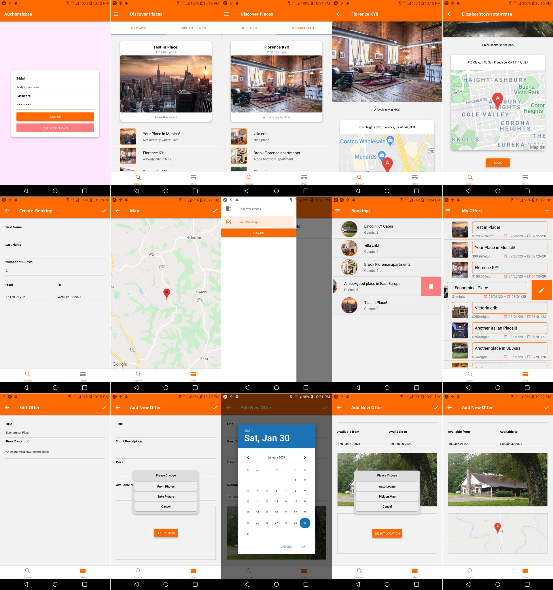
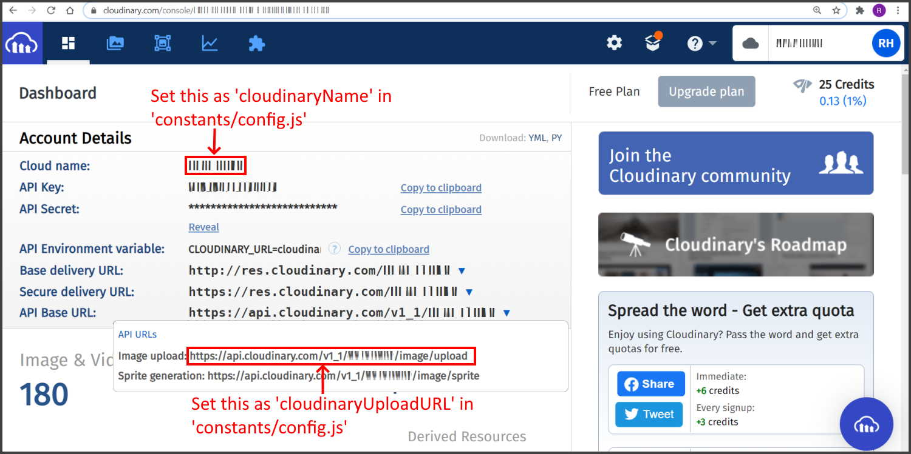
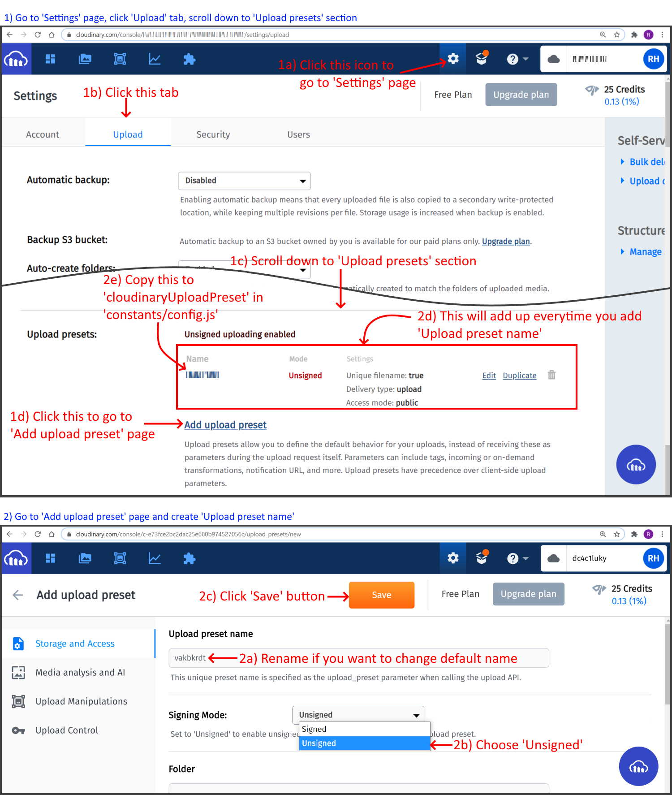
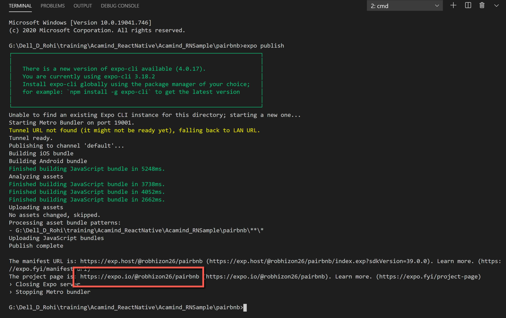

I converted the online training material [Ionic - Build iOS, Android & Web Apps with Ionic & Angular](https://www.udemy.com/course/ionic-2-the-practical-guide-to-building-ios-android-apps/) in Udemy by Maximilian Schwarzmüller to React Native. 

You can see the source code of the training material [here](https://github.com/robhizon26/pairbnb-ionic-ng).

## See this app on Demo 
You can run this on your Android device as an Expo app. Please scan the QR code [here](https://expo.io/@robhizon26/projects/pairbnb). You may need to install Expo client on your device if you haven't done so. 

When you run the app, you will be asked for login or signup for fictitious user. You may use my test user `test@gmail.com/password` credential if you just want to login and navigate the app. 
This is just the ready app that is connecting to my Firebase account and database.

 
## How to run this project  
1. Create `config.js` file in `constants/config.js` with content of:
    ```javascript
    export default {
        firebaseAPIKey:'',
        googleMapsAPIKey:'',
        firebaseURL:'',
        cloudinaryUploadURL:'',
        cloudinaryName:'',
        cloudinaryUploadPreset:'' 
    }
    ```

2. You need create a Firebase account because that is where the database is stored, that is where the image is uploaded, and that is where authentication is happening.

3. Setup your Cloudinary account and obtain parameters you need to fill up on #1. This approach has the advantage not to use a node server deployed in Firebase function. It will also not your Firebase Storage for uploading images as it is uploaded in your Cloudinary storage account.

4. You can run *expo start* or *npm start* to run the app on the browser.

## Setting up Cloudinary
Uploading to Cloudinary is done over HTTPS using a secure protocol based on your account’s cloud_name, api_key and api_secret parameters. This requires a backend server coding logic pretty much similar on how the original app was accomplished using Firebase function and NodeJS.

Another approach is using an unsigend upload without an authentication signature. This is the approach that we did here. 
1. Create a cloudinary account [here](https://cloudinary.com/users/register/free). 
2. After signing up, you'll be redirected to you dashboard. Copy the 'Cloud name' and 'API URLS-Image Upload' to cloudinaryName and cloudinaryUploadURL, respectively, in your `constants/config.js` file.

3. Create your 'Upload  Preset Name' and copy it to cloudinaryUploadPreset in your `constants/config.js` file.

## How to upload an app to Expo server
>By doing this you will allow your Android device to run the app without the need to upload it in Google Play or install it as an apk/aab file. 

1. You must first create an account on https://expo.io/.
2. You can run *expo publish* to publish it on Expo server.
3. After doing #2, you will be given a link where you can open it up in the browser and scan the QR code on your device.   


## Other options to publish your app 
The approach above for uploading this app to Expo server and scanning its QR code is just one way on how to deploy your app. You usually do this to make it faster to test out the app among peers or beta testers. This is called managed Expo app. The following are not within the scope of this demo. 
1. Managed Expo app can run on your device through an Expo client wrapper installed on your device. However, the Expo team also allows you to further publish your app to Google Play or App Store. 
2. You can also eject your Expo app to make it Expo Bare. You can then build this as an Android native app or as an iOS native app. Then, you can open, run, and build the Android app on Android Studio and deploy/publish it to Google play. Same goes with the iOS app. You can open, run, and build it on XCode and deploy/publish it to  App store.   
3. You can start to create a React Native app without Expo altogether. You can then build this as an Android native app or as an iOS native app. Then, you can open, run, and build the Android app on Android Studio and deploy/publish it to Google play. Same goes with the iOS app. You can open, run, and build it on XCode and deploy/publish it to  App store.